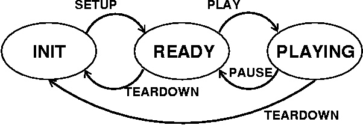

# Programming Assignment 7: Streaming Video with RTSP and RTP

### Original Assignment Link

The original page for this assignment briefing and code is available [here](http://media.pearsoncmg.com/aw/aw_kurose_network_3/labs/lab7/lab7.html).

-----

In this lab you will implement a streaming video server and client that
communicate using the Real-Time Streaming Protocol (RTSP) and send data
using the Real-time Transfer Protocol (RTP). Your task is to implement
the RTSP protocol in the client and implement the RTP packetization in
the server.

We will provide you code that implements the RTSP protocol in the
server, the RTP de-packetization in the client, and takes care of
displaying the transmitted video. You do not need to touch this code.

### Classes

There are 4 classes in the assignment.

[Client](Client.java):
    This class implements the client and the user interface which you
    use to send RTSP commands and which is used to display the video.
    Below is what the interface looks like. *You will need to implement
    the actions that are taken when the buttons are pressed*.

[Server](Server.java):
    This class implements the server which responds to the RTSP requests
    and streams back the video. The RTSP interaction is already
    implemented and the server calls routines in the RTPpacket class to
    packetize the video data. You do not need to modify this class.

[RTPpacket](RTPpacket.java):
    This class is used to handle the RTP packets. It has separate
    routines for handling the received packets at the client side which
    is given and you do not need to modify it (but see [Optional Exercises](#optional-exercises)).
    *You will need to complete the first constructor of this class to
    implement RTP-packetization of the video data*. The second constructor is
    used by the client to de-packetize the data. You do not need to modify that.

[VideoStream](VideoStream.java):
    This class is used to read video data from the file on disk. You do
    not need to modify this class.

### Running the Code

**After completing the code, you can run it as follows**.

First, start the server with the command

            java Server server_port

where `server_port` is the port your server listens to for incoming RTSP
connections. The standard RTSP port is 554, but you will need to choose
a port number greater than 1024.

Then, start the client with the command

            java Client server_name server_port video_file

where `server_host` is the name of the machine where the server is
running, `server_port` is the port the server is listening on, and
`video_file` is the name of the file you want to request (we have
provided one example file `movie.Mjpeg`). The file format is described
in the [Appendix](#appendix).

The client opens a connection to the server and pops up a window like
this:

You can send RTSP commands to the server by pressing the buttons. A
normal RTSP interaction goes as follows.

1.  Client sends SETUP. This command is used to set up the session and
    transport parameters.
2.  Client sends PLAY. This starts the playback.
3.  Client may send PAUSE if it wants to pause during playback.
4.  Client sends TEARDOWN. This terminates the session and closes the
    connection.

The server always replies to all the messages the client sends. The reply
codes are roughly the same as in HTTP. The code 200 means that the
request was successful. In this lab you do not need to implement any
other reply codes. For more information about RTSP, please see RFC 2326.

------------------------------------------------------------------------

### 1. Client

Your first task is to implement the RTSP on the client side. To do this,
you need to complete the functions that are called when the user clicks
on the buttons in the user interface. For each button in the interface
there is a handler function in the code. You will need to implement the
following actions in each handler function.

When the client starts, it also opens the RTSP socket to the server. Use
this socket for sending all RTSP requests.

### SETUP

-   Create a socket for receiving RTP data and set the timeout on the
    socket to 5 milliseconds.
-   Send SETUP request to server. You will need to insert the Transport
    header in which you specify the port for the RTP data socket you
    just created.
-   Read reply from server and parse the Session header in the response
    to get the session ID.

### PLAY

-   Send PLAY request. You must insert the Session header and use the
    session ID returned in the SETUP response. You must not put the
    Transport header in this request.
-   Read server's response.

### PAUSE

-   Send PAUSE request. You must insert the Session header and use the
    session ID returned in the SETUP response. You must not put the
    Transport header in this request.
-   Read server's response.

### TEARDOWN

-   Send TEARDOWN request. You must insert the Session header and use
    the session ID returned in the SETUP response. You must not put the
    Transport header in this request.
-   Read server's response.

**Note:** *You must insert the CSeq header in every request you send*.
The value of the CSeq header is a number which is incremented by one for
each request you send.

### Example

Here is a sample interaction between the client and server. The
client's requestes are marked with C: and server's replies with S:. In
this lab both the client and the server are **very simple**. They do not
have sophisticated parsing routines and they *expect the header fields
to be in the order you see below*. That is, in a request, the first
header is CSeq, and the second one is either Transport (for SETUP) or
Session (for all other requests). In the reply, CSeq is again the first
and Session is the second.

    C: SETUP movie.Mjpeg RTSP/1.0
    C: CSeq: 1
    C: Transport: RTP/UDP; client_port= 25000

    S: RTSP/1.0 200 OK
    S: CSeq: 1
    S: Session: 123456

    C: PLAY movie.Mjpeg RTSP/1.0
    C: CSeq: 2
    C: Session: 123456

    S: RTSP/1.0 200 OK
    S: CSeq: 2
    S: Session: 123456

    C: PAUSE movie.Mjpeg RTSP/1.0
    C: CSeq: 3
    C: Session: 123456

    S: RTSP/1.0 200 OK
    S: CSeq: 3
    S: Session: 123456

    C: PLAY movie.Mjpeg RTSP/1.0
    C: CSeq: 4
    C: Session: 123456

    S: RTSP/1.0 200 OK
    S: CSeq: 4
    S: Session: 123456

    C: TEARDOWN movie.Mjpeg RTSP/1.0
    C: CSeq: 5
    C: Session: 123456

    S: RTSP/1.0 200 OK
    S: CSeq: 5
    S: Session: 123456

### Client State

One of the key differences between HTTP and RTSP is that in RTSP each
session has a state. In this lab you will need to keep the client's
state up-to-date. Client changes state when it receives a reply from the
server according to the following state diagram.

------------------------------------------------------------------------

### 2. Server

On the server you will need to implement the packetization of the video
data into RTP packets. For this you will need to create the packet, set
the fields in the packet header, and copy the payload (i.e., one video
frame) into the packet.

When the server receives the PLAY-request from the client, it starts a
timer which is triggered every 100 ms. At these times the server will
read one video frame from the file and send it to the client. The server
creates an RTPpacket-object which is the RTP-encapsulation of the video
frame.

The server calls the first constructor of the class RTPpacket to perform
the encapsulation. Your task is to write this function. You will need to
do the following: (the letters in parenthesis refer to the fields in the
RTP packet format below)

1.  Set the RTP-version field (V). You must set this to 2.
2.  Set padding (P), extension (X), number of contributing sources (CC),
    and marker (M) fields. *These are all set to zero in this lab*.
3.  Set payload type field (PT). In this lab we use MJPEG and the type
    for that is 26.
4.  Set the sequence number. The server gives this the sequence number
    as the `Framenb` argument to the constructor.
5.  Set the timestamp. The server gives this number as the `Time`
    argument to the constructor.
6.  Set the source identifier (SSRC). This field identifies the server.
    You can pick any integer value you like.

Because we have no other contributing sources (field CC == 0), the
CSRC-field does not exist. The length of the packet header is therefore
12 bytes, or the first three lines from the diagram below.

        0                   1                   2                   3
        0 1 2 3 4 5 6 7 8 9 0 1 2 3 4 5 6 7 8 9 0 1 2 3 4 5 6 7 8 9 0 1
       +-+-+-+-+-+-+-+-+-+-+-+-+-+-+-+-+-+-+-+-+-+-+-+-+-+-+-+-+-+-+-+-+
       |V=2|P|X|  CC   |M|     PT      |       sequence number         |
       +-+-+-+-+-+-+-+-+-+-+-+-+-+-+-+-+-+-+-+-+-+-+-+-+-+-+-+-+-+-+-+-+
       |                           timestamp                           |
       +-+-+-+-+-+-+-+-+-+-+-+-+-+-+-+-+-+-+-+-+-+-+-+-+-+-+-+-+-+-+-+-+
       |           synchronization source (SSRC) identifier            |
       +=+=+=+=+=+=+=+=+=+=+=+=+=+=+=+=+=+=+=+=+=+=+=+=+=+=+=+=+=+=+=+=+
       |            contributing source (CSRC) identifiers             |
       |                             ....                              |
       +-+-+-+-+-+-+-+-+-+-+-+-+-+-+-+-+-+-+-+-+-+-+-+-+-+-+-+-+-+-+-+-+

You must fill in the header in the array `header` of the
RTPpacket-class. You will also need to copy the payload (given as
argument `data`) to the variable `payload`. The length of the payload is
given in the argument `data_length`.

The above diagram is in the network byte order (also known as
big-endian). The Java Virtual Machine uses the same byte order so you do
not need to transform your packet header into the network byte order.

For more details on RTP, please see RFC 1889.

### Twiddling the Bits

Here are some examples on how to set and check individual bits or groups
of bits. Note that in the RTP packet header format smaller bit-numbers
refer to higher order bits, that is, bit number 0 of a byte is 2\^7 and
bit number 7 is 1 (or 2\^0). In the examples below, the bit numbers
refer to the numbers in the above diagram.

Because the header-field of the RTPpacket class is an array of type
`byte`, you will need to set the header one byte at a time, that is in
groups of 8 bits. The first byte has bits 0-7, the second byte has bits
8-15, and so on. In Java an int is 32 bits or 4 bytes.

To set bit number *n* in variable `mybyte` of type byte:

            mybyte = mybyte | 1 << (7 - n);

To set bits *n* and *n + 1* to the value of `foo` in variable `mybyte`:

           mybyte = mybyte | foo << (7 - n);

Note that `foo` must have a value that can be expressed with 2 bits,
that is, 0, 1, 2, or 3.

To copy a 16-bit integer `foo` into 2 bytes, `b1` and `b2`:

           b1 = foo >> 8;
           b2 = foo & 0xFF;

After this, `b1` will have the 8 high-order bits of `foo` and `b2` will
have the 8 low-order bits of `foo`.

You can copy a 32-bit integer into 4 bytes in a similar way.

If you're not comfortable setting bits, you can find more information
in [the Java Tutorial](https://docs.oracle.com/javase/tutorial/java/nutsandbolts/op3.html).

### Bit Example

Suppose we want to fill in the first byte of the RTP packet header with
the following values:

-   V = 2
-   P = 0
-   X = 0
-   CC = 3

In binary this would be represented as

            1 0 | 0 | 0 | 0 0 1 1
            V=2   P   X   CC = 3

           2^7 . . . . . . . . 2^0

------------------------------------------------------------------------

### Optional Exercises

-   Instead of the normal server given to you, use the class called
    [FunkyServer](http://media.pearsoncmg.com/aw/aw_kurose_network_3/labs/lab7/FunkyServer.class) (download also the class
    [FunkyServer\$1.class](http://media.pearsoncmg.com/aw/aw_kurose_network_3/labs/lab7/FunkyServer$1.class)),
    i.e., run it with `java FunkyServer server_port`. What do you see at the client?
    Explain what happens, why, and fix it.
-   Calculate statistics about the session. You will need to calculate
    RTP packet loss rate, video data rate (in bits or bytes per second),
    and any other interesting statistics you can think of.
-   The user interface on the client has 4 buttons for the 4 actions. If
    you compare this to a standard media player, such as RealPlayer or
    Windows Media Player, you can see that they have only 3 buttons for
    the same actions, namely, PLAY, PAUSE, and STOP (roughly
    corresponding to TEARDOWN). There is no SETUP-button available to
    the user. Given that SETUP is mandatory in an RTSP-interaction, how
    would you implement that in a media player? When does the client
    send the SETUP? Come up with a solution and implement it. Is it
    appropriate to send TEARDOWN when user clicks on the stop-button?
-   Currently the client and server only implement the minimum necessary
    RTSP interactions and PAUSE. Implement the method DESCRIBE which is
    used to pass information about the media stream. When the server
    receives a DESCRIBE-request, it sends back a session description
    file which tells the client what kinds of streams are in the session
    and what encodings are used.

Appendix
---------------------

Lab's proprietary MJPEG (Motion JPEG) format.

In this lab, the server streams a video which has been encoded into a
proprietary MJPEG file format. This format stores the video as
concatenated JPEG-encoded images, with each image being preceded by a
5-Byte header which indicates the bit size of the image. The server
parses the bitstream of the MJPEG file to extract the JPEG images on the
fly. The server sends the images to the client at periodic intervals.
The client then displays the individual JPEG images as they arrive from
the server.
